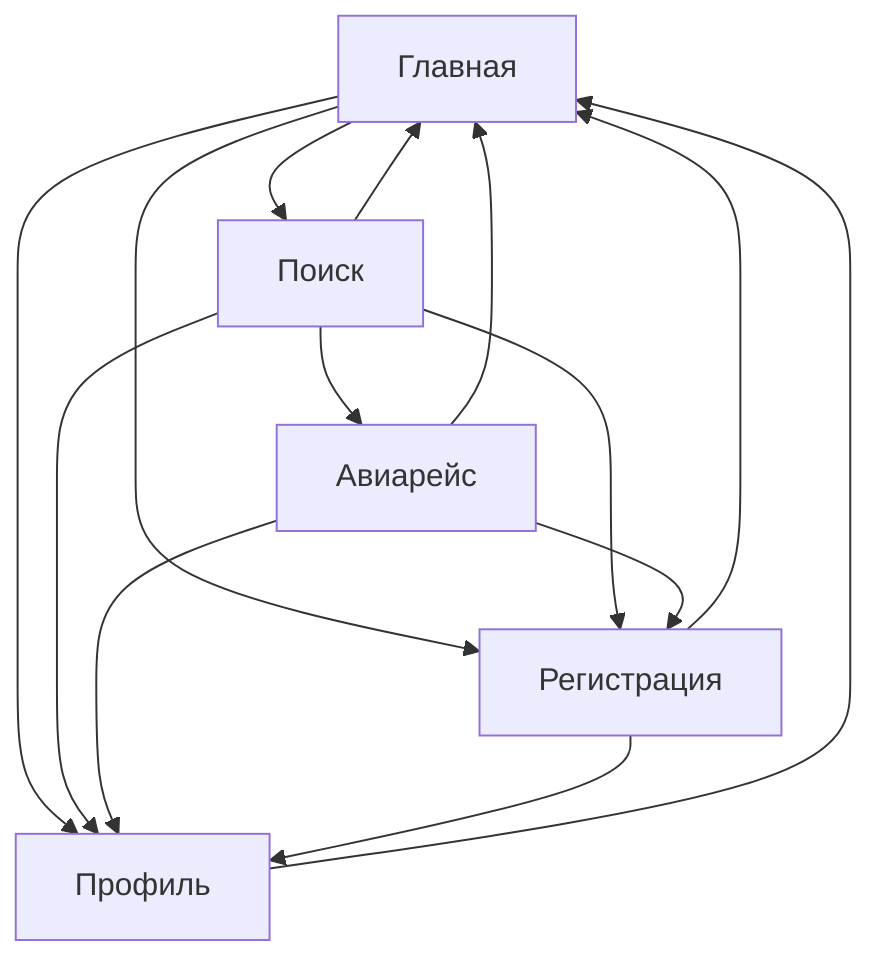

# Вариант 15: Система информации об авиарейсах и билетах

1. Система управления информацией о рейсах, наличии билетов и ценах на них, а также продажи билетов
2. Поддерживаемые данные
    - Авиарейсы
        - Компания, номер
        - Аэропорты вылета и прилета
        - Время и даты вылета и прилета
        - Стоимость билетов
        - Количество мест и наличие свободных мест
    - Клиенты
        - ФИО
        - Контактная информация: адрес, телефон, e-mail
        - Заказанные билеты, оплаченные билеты
        - Наличие бонусных карт авиакомпаний
        - Налетанные километры по каждой авиакомпании, использование для оплаты других билетов
3. Поддерживаемые операции
    - Получение списка авиарейсов по датам и направлениям, информации о ценах билетов и наличии свободных мест
    - Получение списка клиентов, в т.ч. летавших определенным рейсом, любыми рейсами авиакомпании, заказавших и оплативших билеты
    - Получение истории заказов клиента, информации о его бонусах и их использовании
    - Заказ и оплата билетов на выбранный рейс
    - Добавление и удаление рейса, чтение и редактирование данных о нем
    - Добавление и удаление клиента, чтение и редактирование данных о нем

# Концептуальная модель пользовательского интерфейса

## Страницы приложения

- **Главная страница**
    - Данные:
        - Поисковая строка с несколькими ячейками:
            - Город вылета
            - Город прилета
            - Дата вылета
            - Количество билетов
            - Класс обслуживания
        - Кнопка применения фильтров поиска
        - Кнопки перехода на другие страницы (см. Навигация)
        - Логотип сервиса
        - Надпись "Поиск авиабилетов" над строкой поиска
        - Кнопка авторизации
    - Действия:
        - Ручной ввод данных в поля "Город вылета" и "Город прилета"
        - Выбор предложенного значения в полях "Дата вылета", "количество билетов" и "Класс обслуживания"
        - Навигация
        - Применение фитров поиска

- **Результаты поиска**
    - Данные:
        - Поисковая строка с несколькими ячейками (для изменения текущих фильтров)
        - Список релевантных авиарейсов, данные о них:
            - Цена билета
            - Компания, осуществляющая авиарейс
            - Количество оставшихся билетов
            - Точное время вылета
            - Точное время прилета
            - Время в пути
        - Кнопка применения фильтров поиска
        - Кнопки перехода на другие страницы (см. Навигация)
        - Логотип сервиса
    - Действия:
        - Переход к просмотру конкретного рейса
        - Выбор предложенного значения в полях "Дата вылета", "количество билетов" и "Класс обслуживания"
        - Повторное применение фитров поиска
        - Навигация

- **Конкретный рейс**
    - Данные:
        - Данные о рейсе:
            - Цена билета
            - Компания, осуществляющая авиарейс
            - Количество оставшихся билетов
            - Точное время вылета
            - Точное время прилета
            - Время в пути
        - Кнопка авторизации
        - Данные о свободных и занятых местах
        - Кнопка заказа билетов
        - Кнопки перехода на другие страницы (см. Навигация)

    - Действия:
        - Выбор конкретных свободных мест
        - Заказ билетов
        - Применение бонусов
        - Навигация

- **Профиль**
    - Данные:
        - Данные о пользователе (ФИО и т.п.)
        - Список текущих заказов
        - История заказов
        - Текущие бонусы
        - Навигация
    - Действия:
        - Отмена заказа
        - Редактирование данных

- **Регистрация**
    - Данные:
        - Поле ввода данных о пользователе
        - Кнопка регистрации
    - Действия:
        - Ввод данных
        - Завершение регистрации

## Сценарии использования

1. Поиск релевантных билетов (Главная страница &rarr; Поиск)
2. Покупка билета (Главная страница &rarr; Поиск &rarr; Авиарейс)
3. Отказ от билета (Главная страница &rarr; Профиль (Список текущих заказов))
4. Просмотр истории заказов (Главная страница &rarr; Профиль (История))
5. Регистрация (Главная страница &rarr; Регистрация)
6. Изменение информации о пользователе (Главная страница &rarr; Профиль)

## Навигация

## База данных

